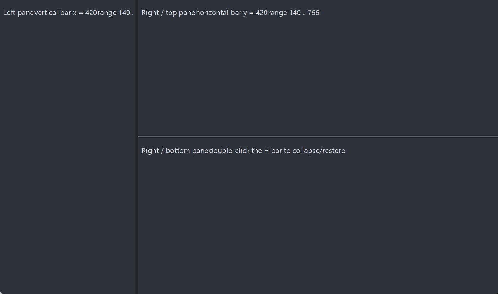

# PsSplitter

An owner-drawn splitter bar for FreeBASIC Win32 applications: a draggable divider that sits
between two panes, shows a resize cursor when the mouse is over it, and tells you where the
user dragged it to.

**It does not own, create, size or even know about the panes on either side of it.** The
control maintains exactly one number — the bar's position — moves itself while the user drags,
and calls you back. Laying out whatever is to the left and right (or above and below) is
entirely yours, and so is deciding what the limits are. That is the trade: you get correct
drag mechanics, cursor handling, capture discipline and hot-tracking for free, and you still
write your own layout pass.

It draws itself entirely — there is no system control underneath, and nothing about its
appearance depends on the visual style the user happens to be running. Both colours it paints
are ones you can set, and a paint callback replaces the built-in painter outright.

---

## What it looks like



One vertical bar and one horizontal bar dividing three panes. The **bars are the thin lines**; the panes are the host's own windows. The control does not own, create or know about them — it moves itself and reports its new position, and the host resizes whatever sits either side.

---

## Requirements

**Files to copy into your project:**

| File | Purpose |
|---|---|
| `PsSplitter.bi` | Declarations — types, callbacks, constants, function prototypes |
| `PsSplitter.inc` | Implementation |
| `PsBufferPaint.bi` | The flicker-free drawing surface the control paints through |
| `PsBufferPaint.inc` | Its implementation |

**AfxNova is required.** The control is built on `CWindow`, and `PsBufferPaint` draws through
`AfxNova\CGdiPlus.inc`. Sources include AfxNova relative to the workspace root
(`#include once "AfxNova\CWindow.inc"`), so builds need the workspace root on the include
path:

```bash
fbc64.exe -i "C:\dev" main.bas
```

**Include order.** `PsSplitter.inc` pulls in its own `.bi`, which pulls in `PsBufferPaint.bi`.
The two implementation files are included in this order, after the AfxNova headers:

```freebasic
#include once "windows.bi"
#include once "AfxNova\CWindow.inc"
#include once "AfxNova\AfxStr.inc"
#include once "AfxNova\AfxGdiplus.inc"

using AfxNova

#include once "PsBufferPaint.inc"
#include once "PsSplitter.inc"
```

**GDI+ must be running before the first repaint and must outlive the last one.** The control
renders through GDI+, so bracket your message loop:

```freebasic
dim as ULONG_PTR gdipToken = AfxGdipInit()
' ... create windows, run the message loop ...
AfxGdipShutdown( gdipToken )
```

`AfxGdipShutdown` must come after every window is destroyed, because each repaint builds and
tears down a `PsBufferPaint`.

**Never name an identifier `ok`.** GDI+ defines `Ok = 0` as a `Status` enum value in namespace
`AfxNova`, and hosts customarily say `using AfxNova`. An existing variable, parameter or
function called `ok` becomes a duplicate definition the moment you adopt these files. Use
`bOK` instead.

**There is no pump obligation.** The control needs no message filter, no `IsDialogMessage` and
no accelerator cooperation. It never takes focus and handles no keys, so an ordinary
`GetMessage` / `TranslateMessage` / `DispatchMessage` loop is enough.

---

## Quick start

A vertical bar between a left and a right pane. The panes here are two child windows the host
already owns; the control never sees them.

```freebasic
dim shared as HWND hSplit
dim shared as long gBarW          ' the bar's thickness, DPI-scaled once in the layout pass

' Create it. The control is created zero-sized and hidden.
hSplit = PsSplitter_Create( hWndParent, IDC_MYFORM_SPLITTER, PSSPLITTER_VERTICAL )

' Colours for the built-in painter: idle, and hot/dragging.
PsSplitter_SetColors( hSplit, BGR(53,59,69), BGR(90,98,112) )

' Be told when the user drags it.
PsSplitter_SetPosChangedCallback( hSplit, @MySplit_PosChanged )

' Initial position: the bar's x, in the parent's client coordinates. Silent.
PsSplitter_SetPos( hSplit, 240 )
```

Your layout pass owns the bar's size, its cross-axis geometry, and the limits:

```freebasic
sub MyForm_Layout( byval hwnd as HWND )
    dim pWindow as CWindow ptr = AfxCWindowPtr(hwnd)
    if pWindow = 0 then exit sub

    dim as RECT rc : GetClientRect( hwnd, @rc )
    gBarW = pWindow->ScaleX( 6 )                    ' bar thickness = the grab area
    dim as long minPaneW = pWindow->ScaleX( 80 )

    ' The control never derives its own limits -- push them in from here.
    PsSplitter_SetRange( hSplit, minPaneW, rc.right - minPaneW - gBarW )

    SetWindowPos( hSplit, 0, _
        PsSplitter_GetPos( hSplit ), rc.top, gBarW, rc.bottom - rc.top, _
        SWP_NOZORDER or SWP_SHOWWINDOW )

    MyForm_LayoutPanes( PsSplitter_GetPos( hSplit ) )
end sub
```

And the callback, which is where the two panes are resized:

```freebasic
sub MyForm_LayoutPanes( byval nPos as integer )
    dim as RECT rc : GetClientRect( HWND_FRMMAIN, @rc )
    dim as long xRight = nPos + gBarW               ' the bar's TRAILING edge

    SetWindowPos( hLeftPane,  0, rc.left, rc.top, nPos - rc.left,   rc.bottom - rc.top, _
                  SWP_NOZORDER )
    SetWindowPos( hRightPane, 0, xRight,  rc.top, rc.right - xRight, rc.bottom - rc.top, _
                  SWP_NOZORDER )
end sub

sub MySplit_PosChanged( byval hSplitter as HWND, byval newPos as integer, _
                        byval nPhase as integer )
    ' The control has already moved ITSELF. Lay out only what it does not own.
    MyForm_LayoutPanes( newPos )

    ' BEGIN and END bracket the drag -- use them for work too expensive to do per pixel.
    select case nPhase
        case PSSPLITTER_PHASE_BEGIN : MyPanes_SuspendReflow()
        case PSSPLITTER_PHASE_END   : MyPanes_ResumeReflow() : gConfig.SplitPos = newPos
    end select
end sub
```

That is the whole minimum. Everything below is refinement.

---

## Concepts

### The orientation is named for the BAR's own axis

This is the first thing to get right, because it is easy to get backwards:

| Orientation | The bar is | It separates | It drags | Cursor | `nPos` is |
|---|---|---|---|---|---|
| `PSSPLITTER_VERTICAL` | a vertical line | a **left** and a **right** pane | horizontally | `IDC_SIZEWE` | the bar's **x** |
| `PSSPLITTER_HORIZONTAL` | a horizontal line | a **top** and a **bottom** pane | vertically | `IDC_SIZENS` | the bar's **y** |

A vertical splitter does *not* split a window vertically into a top and a bottom — it *is* a
vertical bar, and it splits left from right.

The orientation is fixed for the control's lifetime. A host that switches split modes destroys
the control and creates the other one; there is no setter, because an `nPos` whose meaning
changed axis underneath a stale range is worse than a rebuild.

### The position is the bar's leading edge, in the PARENT's client coordinates

Exactly one number, and it means exactly one thing:

```
  PSSPLITTER_VERTICAL     nPos = the x of the bar's LEFT edge, in parent client coords
  PSSPLITTER_HORIZONTAL   nPos = the y of the bar's TOP  edge, in parent client coords
```

It is the *leading* edge, not the centre and not the trailing edge — so the right pane of a
vertical split starts at `nPos + barWidth`, not at `nPos`. The parent whose client space this
is, is the `hWndParent` you passed to `PsSplitter_Create`; the control captures it once and
never changes it. `nMin` and `nMax` live in the same space, and so does the `newPos` your
callback receives.

### The width you give the bar IS the grab area

There is no separate hit margin. The whole client rectangle is the bar, and any mouse move
that reaches the control means the cursor is on it. If you want a thin visual line inside a
comfortable grab area, size the control comfortably and paint a thin line inside it with a
paint callback.

### The three drag phases

A user drag produces one `BEGIN`, zero or more `MOVE`s, and one `END`, in that order, all
through the single `SPL_PosChangedCallback`:

| Phase | When | `newPos` | What a host typically does |
|---|---|---|---|
| `PSSPLITTER_PHASE_BEGIN` | The user just grabbed the bar. Fired from the button-down, before the bar has moved at all. | The **current**, unchanged position | Start the gesture: hide anything expensive (scrollbars), suspend a reflow, snapshot state |
| `PSSPLITTER_PHASE_MOVE` | The position actually changed. Never fired when the clamped position works out the same as before. | The new position, already applied | Lay out the two panes. This is the per-pixel work, so keep it cheap |
| `PSSPLITTER_PHASE_END` | The drag ended: the button came up, or the capture was lost. | The final position | Commit: resume the reflow, persist the position to config |

`END` always arrives, including when another window steals the capture mid-drag — a stolen
capture is treated as an implicit button-up, keeping the position the user dragged to, because
every intermediate position has already been applied and there is nothing to undo. By the time
`END` runs the state is consistent: `PsSplitter_IsDragging` already returns FALSE.

**By the time any of the three fires, the control has already moved itself.** Do not move the
bar from inside the callback; lay out the panes and stop. Re-placing the bar from your own
layout pass is harmless — it is a no-op — but it is not something the callback needs to do.

### Who owns what

| Owned by the control | Owned by you |
|---|---|
| The bar's position along its drag axis | The bar's thickness, its cross-axis position and its extent |
| Clamping to the range | Computing the range and pushing it in with `SetRange` |
| Cursor, hover, capture, the drag arithmetic | Everything on both sides of the bar |
| Its own repaint | Repainting your panes |
| — | Collapse / restore, if you want it |

The control never derives the range from the parent's client rect. It cannot: it has no idea
what else lives in that space — a toolbar, another splitter, a scrollbar parked between the
pane and the bar. Recompute the limits in your own `WM_SIZE` and call `PsSplitter_SetRange`.

### Programmatic changes are silent

`PsSplitter_SetPos` and `PsSplitter_SetRange` clamp, move the bar and repaint, and fire
**nothing**. They are the host telling the control where it put the splitter, not the user
moving it — Win32's own setter/notification split. It means you can call either from inside
the position callback without re-entering yourself, and it means a programmatic move must be
followed by your own pane layout and repaint, because no callback will come back to do it.

### The control re-syncs when you move it

If you move the bar yourself — a parent resize, a pane collapse, a plain `SetWindowPos` in a
layout pass — the control notices through `WM_WINDOWPOSCHANGED` and records the new leading
edge as its position. So `PsSplitter_GetPos` always agrees with where the bar actually is, and
a host that repositions the splitter during a layout pass cannot desync it.

That re-sync is an *observation*, not a change: nothing is clamped and nothing is notified. If
you `SetWindowPos` the bar outside its own range, `GetPos` reports the out-of-range value
honestly; the next drag or `SetPos` pulls it back in.

The re-sync is skipped while a drag is in progress, where the control is the one doing the
moving.

### Hover, and how it is cleared

The bar paints brighter while the mouse is over it. `WM_MOUSELEAVE` is requested, but it is not
reliably delivered when the cursor leaves fast, so the control also runs a 100 ms polling timer
while it is hot, as a safety net. Whip the mouse off the bar at any speed and the highlight
clears.

While a drag is live the hover state is **pinned true**, because under capture the cursor
legitimately roams far outside the bar's own rectangle and the bar should not go cold in the
middle of the gesture. When the drag ends, hover is re-derived from where the cursor actually
finished.

Hiding the control — collapsing a pane, say — ends any drag and clears hover, so the highlight
cannot reappear stale the next time you show it.

### Mouse capture

The control takes the capture on the button-down and releases it on the button-up, because a
drag needs the down/up pairing guaranteed. Capture is taken **before** your message callback
runs, so a callback that claims the down-message still gets a clean, matched release — that is
what makes double-click collapse work.

The consequence to know about: your message callback's return value is **ignored for
`WM_LBUTTONUP`**. A host allowed to suppress that message would strand the capture, and every
subsequent click anywhere in the application would be routed to the splitter.

### Double-click

The control's window class carries `CS_DBLCLKS`, so a rapid second click arrives as
`WM_LBUTTONDBLCLK`. The control itself does nothing special with it — it runs the same
capture-and-begin-drag bookkeeping as an ordinary down, which it must, or the trailing up
would release a capture that was never taken.

Collapse/restore is therefore **yours to implement**, and claiming `WM_LBUTTONDBLCLK` from the
message callback is the supported way: return TRUE, no drag starts, and the trailing
`WM_LBUTTONUP` is harmless. Inside that handler, `PsSplitter_SetPos` moves the bar silently, so
repaint your panes yourself.

Note the sequence is `down, up, dblclk, up` — the first click of a double-click is a real
click, and it will have begun and ended a zero-length drag (one `BEGIN`, one `END`) before the
double-click arrives.

### Everything is raw pixels

Nothing in this control is DPI-scaled for you. Positions, limits, the bar's thickness — all of
it is pixels in the parent's client space, and you scale them yourself, typically with
`pWindow->ScaleX(...)` / `ScaleY(...)`. There is nothing to scale internally: the control
measures no text and owns no font.

### Lifetime

The control frees itself when its window is destroyed, killing its hover timer and releasing
any capture it still holds. It loads no resource that needs freeing — the resize cursors are
shared system cursors, and you must never `DestroyCursor` them. Destroy the parent and you are
done.

---

## Behaviour and limits

Firm properties of the control, not settings:

- **It does not create, size, or know about the panes.** No pane handle is stored and no pane
  is ever moved. Your callback does that work.
- **It does not compute its own limits.** Until `PsSplitter_SetRange` is called the range is
  `0 .. &h7FFFFFFF`, i.e. effectively unbounded. Recompute and re-set the limits from your own
  `WM_SIZE`.
- **The orientation is fixed at creation.** There is no setter. Destroy and recreate to switch.
- **The bar's thickness is the grab area.** No separate hit margin exists.
- **Limits are absolute, not proportional.** `SetRange` takes two coordinates in the parent's
  client space. Nothing is expressed as a fraction or a percentage, and nothing rescales when
  the parent resizes — which is exactly why you must re-push the range on every resize.
- **An inverted range (`nMax < nMin`) pins the bar at `nMin`** rather than rejecting the call.
  A host recomputing limits on `WM_SIZE` legitimately produces one when the window is too small
  to hold both panes, and pinning is the sane result.
- **Programmatic setters are silent.** `PsSplitter_SetPos` and `PsSplitter_SetRange` never fire
  the position callback.
- **The control moves only along its drag axis.** Cross-axis position and size are read back
  from the window and preserved, never invented. If the bar also has to move sideways — a
  horizontal bar living inside the right pane of a vertical split, for instance — that is your
  `SetWindowPos`.
- **No keyboard support at all.** The control is not a tabstop, never takes focus, and handles
  no keys. Keyboard resizing is the host's, through `PsSplitter_SetPos`.
- **No visible chrome beyond a flat fill.** The built-in painter fills the whole bar with one
  colour. Grip dots, a centred hairline or an etched edge are a paint callback's job.
- **No collapse, no restore, no snap, no double-click behaviour of its own.** The control holds
  one number and no memory of a previous one.
- **No enabled/disabled state.** There is no `SetEnabled`. Hide the control, or stop laying it
  out, when a split is not available.
- **No tooltip support.** There is no tooltip callback and no tooltip window is created. Add
  your own tool over the control's `HWND` if you want one.
- **The message callback's result is ignored for `WM_LBUTTONUP`**, so a host cannot strand the
  capture.
- **The message callback is not a general message hook.** It sees only `WM_SETCURSOR`,
  `WM_LBUTTONDOWN`, `WM_LBUTTONDBLCLK`, `WM_MOUSEMOVE` and `WM_LBUTTONUP`. It is never called
  for `WM_PAINT`, `WM_MOUSELEAVE`, `WM_TIMER`, `WM_SIZE` or `WM_WINDOWPOSCHANGED`.
- **`WM_SETCURSOR` reaches the callback only when the hit-test code is `HTCLIENT`, or a drag is
  in progress.** Mid-drag the control claims the cursor unconditionally, because under capture
  the hit-test code can be anything at all — the cursor is over the panes, or off the window.
- **Nothing is DPI-scaled for you.**

---

## API reference

### Creation

| Function | Description |
|---|---|
| `PsSplitter_Create( hWndParent, CtrlID [, nOrientation] ) as HWND` | Creates the control as a child of `hWndParent` and returns its window handle. `CtrlID` becomes the window's `GWLP_ID`, so `GetDlgItem` finds it. `nOrientation` is `PSSPLITTER_VERTICAL` (the default) or `PSSPLITTER_HORIZONTAL`, and is **fixed for the control's lifetime**; any value other than `PSSPLITTER_HORIZONTAL` is taken as `PSSPLITTER_VERTICAL`. `hWndParent` is captured as the coordinate space every position is measured in. Created with `WS_CHILD or WS_CLIPSIBLINGS or WS_CLIPCHILDREN` — **zero-sized and not visible** — so place, size and show it with `SetWindowPos`. The size you give it along the drag axis is the grab area. |

### Position and range

All values are the bar's **leading edge in the parent's client coordinates** — x for a vertical
bar, y for a horizontal one.

| Function | Description |
|---|---|
| `PsSplitter_GetPos( hSplit ) as integer` | The current position. Always agrees with where the bar actually is: the control re-syncs from its own window rect whenever the host moves it. Returns 0 for an invalid handle. |
| `PsSplitter_SetPos( hSplit, nPosition )` | Clamps into the current range, moves the bar and repaints. **Silent** — fires no notification, so lay out and repaint your panes yourself. No-op when the clamped value already matches the current position. |
| `PsSplitter_SetRange( hSplit, nMin, nMax )` | Sets the limits a drag clamps to. Also clamps the **current** position into the new range, moving and repainting the bar if it has to — **silently**, because you set the range and already know. An inverted range (`nMax < nMin`) pins the bar at `nMin` rather than failing. The control never derives these limits itself; recompute and re-set them from your own `WM_SIZE`. |
| `PsSplitter_GetMin( hSplit ) as integer` | The lower limit. Defaults to 0. Returns 0 for an invalid handle. |
| `PsSplitter_GetMax( hSplit ) as integer` | The upper limit. Defaults to `&h7FFFFFFF` — effectively unbounded until `PsSplitter_SetRange` is called. Returns 0 for an invalid handle, which is **not** the default value, so treat a 0 here as a bad handle rather than as a range. |

### Geometry and layout

There are no geometry setters, because the control owns no geometry beyond its position along
the drag axis. Size and place it with `SetWindowPos` like any other window; the control reads
its cross-axis position and its size back from the window and preserves them, and records any
move you make as its new position.

| Function | Description |
|---|---|
| `PsSplitter_GetOrientation( hSplit ) as integer` | `PSSPLITTER_VERTICAL` or `PSSPLITTER_HORIZONTAL` — whichever was fixed at creation. Returns `PSSPLITTER_VERTICAL` for an invalid handle. |
| `PsSplitter_IsHot( hSplit ) as boolean` | TRUE while the mouse is over the bar. **Pinned TRUE for the whole of a drag**, even while the cursor is far outside the bar, and re-derived from the cursor's real position when the drag ends. |
| `PsSplitter_IsDragging( hSplit ) as boolean` | TRUE between the button-down and the button-up (or a lost capture). Already FALSE by the time your `PSSPLITTER_PHASE_END` callback runs. |

### Appearance

| Function | Description |
|---|---|
| `PsSplitter_GetBackColor( hSplit ) as COLORREF` | The idle fill colour. Returns 0 for an invalid handle. There is no matching getter for the hot colour. |
| `PsSplitter_SetColors( hSplit, backclr, hotclr )` | Sets both colours at once and repaints. `backclr` is the idle fill, `hotclr` the fill used while the bar is hot or being dragged. Used by the built-in painter only — a paint callback ignores them both. |

### Callback registration

| Function | Description |
|---|---|
| `PsSplitter_SetPaintCallback( hSplit, usersub )` | Installs a renderer that draws the whole bar **instead of** the built-in painter. Repaints. |
| `PsSplitter_SetMessageCallback( hSplit, userfunc )` | Installs an observer for the control's mouse and cursor messages. |
| `PsSplitter_SetPosChangedCallback( hSplit, usersub )` | Installs the handler told when the **user** moves the splitter. |

All three are optional and independent. Passing a null pointer to any of them clears that
callback; clearing the paint callback restores the built-in painter.

---

## Colors

**There is no colours struct.** The control paints one thing — a flat bar — so its whole
colour surface is two `COLORREF` values, set together by `PsSplitter_SetColors`:

| Colour | Default | Paints |
|---|---|---|
| `BackColor` | `BGR(53,59,69)` | The whole bar, idle |
| `HotColor` | `BGR(90,98,112)` | The whole bar, while the mouse is over it **or** a drag is in progress |

Both ship with a usable dark-theme default, so a control you never call `PsSplitter_SetColors`
on still looks right. Only `BackColor` has a getter.

### Which colour wins

The built-in painter picks one of the two per repaint:

```
hot OR dragging   >   idle
```

There is no third, distinct dragging colour: a live drag renders as hot, which reads correctly
for a bar that is being held. The two states are still handed to a paint callback separately
(`isHot` and `isDragging`), so a custom renderer can draw a distinct dragging look if it wants
one.

There is no disabled colour, because there is no disabled state.

### What the painter draws

The built-in painter fills the entire client rectangle with the chosen colour, through
`PsBufferPaint`. That is all of it. A grip, a hairline, an etched border or a gradient is a
paint callback's job.

---

## Callbacks

### Position changed

```freebasic
type SPL_PosChangedCallbackSub as sub( byval hSplitter as HWND, byval newPos as integer, _
                                       byval nPhase as integer )
```

The **user** moved the splitter. `newPos` is the bar's new leading edge in the parent's client
coordinates; `nPhase` is one of `PSSPLITTER_PHASE_BEGIN`, `PSSPLITTER_PHASE_MOVE` or
`PSSPLITTER_PHASE_END`. See *The three drag phases* above for what each one means and what a
host does with it.

The control has already clamped the position and moved itself by the time you are called. Lay
out the two panes and nothing else.

It does **not** fire for `PsSplitter_SetPos` or `PsSplitter_SetRange`. Programmatic setters are
silent, which is what makes it safe to call either one from inside this very callback.

A `MOVE` is never fired for a position that works out the same as the previous one, so a drag
held against a limit goes quiet rather than repeating.

The same callback can serve any number of splitters — `hSplitter` says which one, and
`PsSplitter_GetOrientation` says which axis it moved on.

### Paint

```freebasic
type SPL_PaintCallbackSub as sub( byval p as PSSPLITTER_PAINTINFO ptr )
```

Draws the whole bar **instead of** the built-in painter — setting a callback replaces that
default entirely, and the two colours stop being used. Paint through `p->b`, the control's
double buffer for this repaint, using `p->rcClient` — do not touch the screen DC.

Nothing is drawn for you before the callback runs: the callback is responsible for every pixel
of the bar, background included.

`PSSPLITTER_PAINTINFO` carries:

| Field | Meaning |
|---|---|
| `hSplitter` | The control, so the callback can query it |
| `b` | The control's `PsBufferPaint` for this repaint (borrowed, not owned) |
| `rcClient` | The whole bar, in client coordinates |
| `nOrientation` | `PSSPLITTER_VERTICAL` or `PSSPLITTER_HORIZONTAL` — one callback can serve both kinds of bar |
| `isHot` | The mouse is over the bar. **Stays TRUE for the whole of a drag** |
| `isDragging` | A drag is in progress |

> **A paint callback that fills a rectangle covering the whole control erases everything under
> it.** For a splitter that is exactly what you want from the *first* call — fill the bar, then
> add your line or grip on top. The trap is a helper that fills as a side effect: a
> "draw a border" primitive that fills unconditionally will wipe out everything drawn before
> it, and the result still compiles, still runs, and still renders a plausible-looking bar.

### Message

```freebasic
type SPL_MessageCallbackFunc as function( byval m as PSSPLITTER_MESSAGEINFO ptr ) as boolean
```

Observes the control's mouse and cursor messages as they arrive. Return TRUE to suppress the
control's own handling of that message, FALSE to let it proceed.

`PSSPLITTER_MESSAGEINFO` carries:

| Field | Meaning |
|---|---|
| `hSplitter` | The control the message arrived at |
| `uMsg` | The message |
| `wParam` | Its `wParam` |
| `lParam` | Its `lParam` |

The callback is invoked for exactly these messages, and no others:

| Message | Effect of returning TRUE |
|---|---|
| `WM_SETCURSOR` | The control does not set its resize cursor, so you own the cursor for this message. Only delivered when the hit-test code is `HTCLIENT`, or a drag is in progress. |
| `WM_LBUTTONDOWN` | **No drag starts** — no `BEGIN` is notified. The capture has already been taken and is released normally on the trailing up. |
| `WM_LBUTTONDBLCLK` | As above. This is the supported way to implement collapse/restore. |
| `WM_MOUSEMOVE` | Neither the drag update nor the hover update runs for this move. |
| `WM_LBUTTONUP` | **Your return value is ignored.** The control holds the mouse capture for the duration of a drag and this up-message is the capture's exit; a callback allowed to suppress it would strand the capture and route every subsequent click in the application here. |

---

## Constants

```freebasic
' Named for the BAR's own axis.
enum PSSPLITTER_ORIENTATION
    PSSPLITTER_VERTICAL   = 0     ' vertical bar,   left/right panes -> IDC_SIZEWE, nPos = x
    PSSPLITTER_HORIZONTAL = 1     ' horizontal bar, top/bottom panes -> IDC_SIZENS, nPos = y
end enum

enum PSSPLITTER_PHASE
    PSSPLITTER_PHASE_BEGIN = 0    ' the user just grabbed the bar; newPos = current position
    PSSPLITTER_PHASE_MOVE  = 1    ' the position actually changed
    PSSPLITTER_PHASE_END   = 2    ' the drag ended (button up, or capture lost); final position
end enum
```

| Constant | Value | Meaning |
|---|---:|---|
| `IDT_CSPLITTER_HOTTRACK` | `&hCB20` | Timer id for the hover poll. Timer ids are per-window, so every instance can share this one — but do not reuse it for a timer of your own on a splitter's `HWND`. |
| `PSSPLITTER_HOTTRACK_MS` | `100` | Hover poll interval, in milliseconds. The safety net that clears the highlight when `WM_MOUSELEAVE` is not delivered. |

## Licence

[Mozilla Public License 2.0](LICENSE).

MPL-2.0 is file-level copyleft, chosen deliberately for a drop-in control:

- **You may use this in closed-source software**, commercial or otherwise.
  §3.2 permits static linking with no additional conditions.
- **If you modify these files, publish those files' changes.** The obligation is
  per-file — your own sources are unaffected however tightly they are combined
  with these.
- The Exhibit B "Incompatible With Secondary Licenses" notice is **not applied**,
  which keeps this GPL-compatible.
